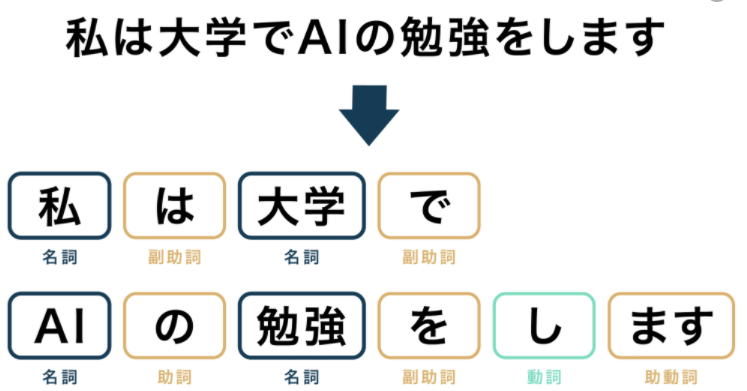

## 自然言語処理の流れ
1. 形態素解析:品詞を与える処理
    - ツール：MeCab
        - Python: Janome
    

1. 構文解析: 文の構造を明らかにする処理
   - ツール：CaboCha
1. 意味解析: テキストを解析し、その意味を決定する処理
1. 文脈解析：複数の分のつながりに関する解析を行う処理

## 自然言語処理の用途
1. 機械翻訳 (Machine Translation)
1. 質問応答システム (Question Answering)
1. 情報抽出 (Information Extraction)
1. 対話システム (Dialog system, Conversational System)

## コーパス
1. コーパスとは記述あるいは口述され、コンピュータ上に格納されたデータ

## 前処理
1. テキストのクリーニング
1. 単語分割: MeCab
1. 単語の正規化
   - 文字種の統一
1. スワップワードの除去
1. 単語のID化
1. パディング

