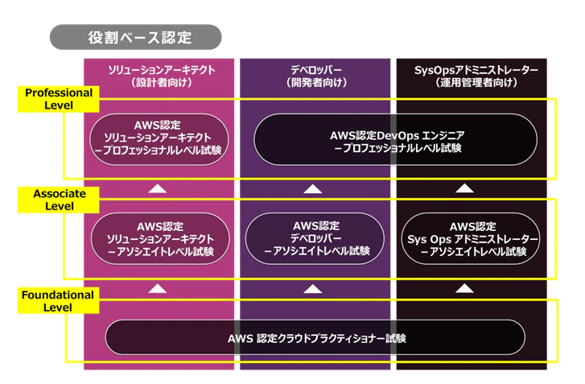

## 参考url
1. https://qiita.com/fukubaka0825/items/238225f9e4c1962bc00c

## 試験概要
1. 試験時間: 130分
1. 問題数: 65
1. 満点: 1000点
1. 合格: 720点
1. 
## 目標
1. 2週間
1. 参考url
    - 学習
        - https://www.udemy.com/aws-associate/
        - ホワイトペーパー|AWS
            - https://aws.amazon.com/jp/whitepapers/?whitepapers-main.sort-by=item.additionalFields.sortDate&whitepapers-main.sort-order=desc
        - AWS活用資料集
            - https://aws.amazon.com/jp/aws-jp-introduction/
1. 学習の進め方
    - AWS Well-Architected Frameworkとベストプラクティス
    - 具体的な試験範囲を押させえる

