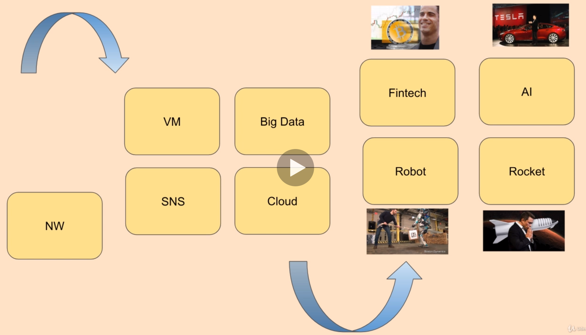
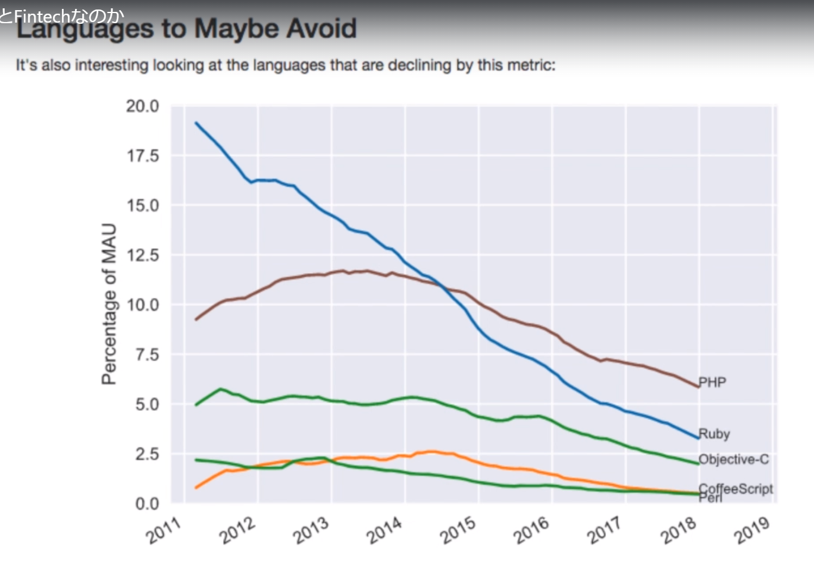
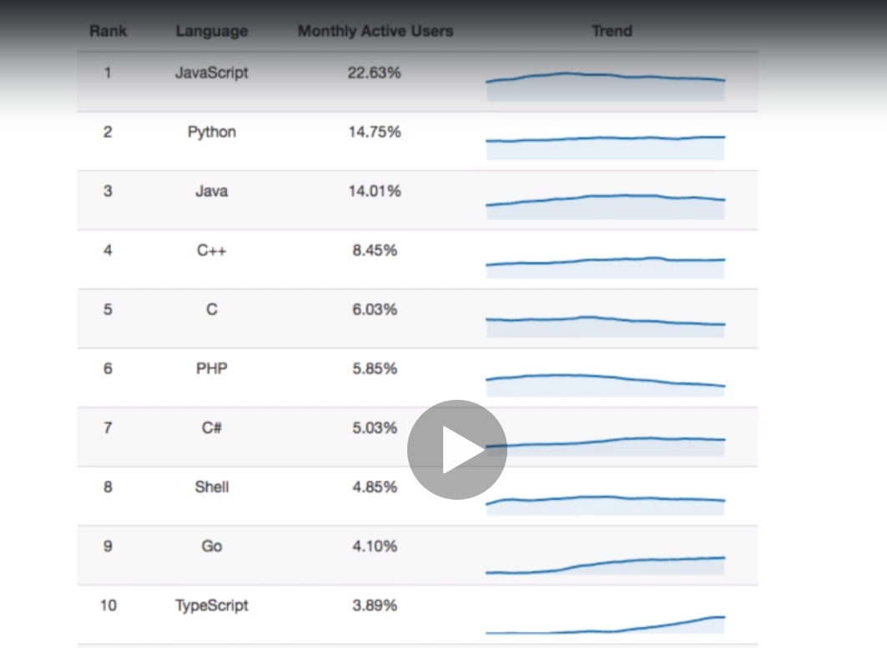
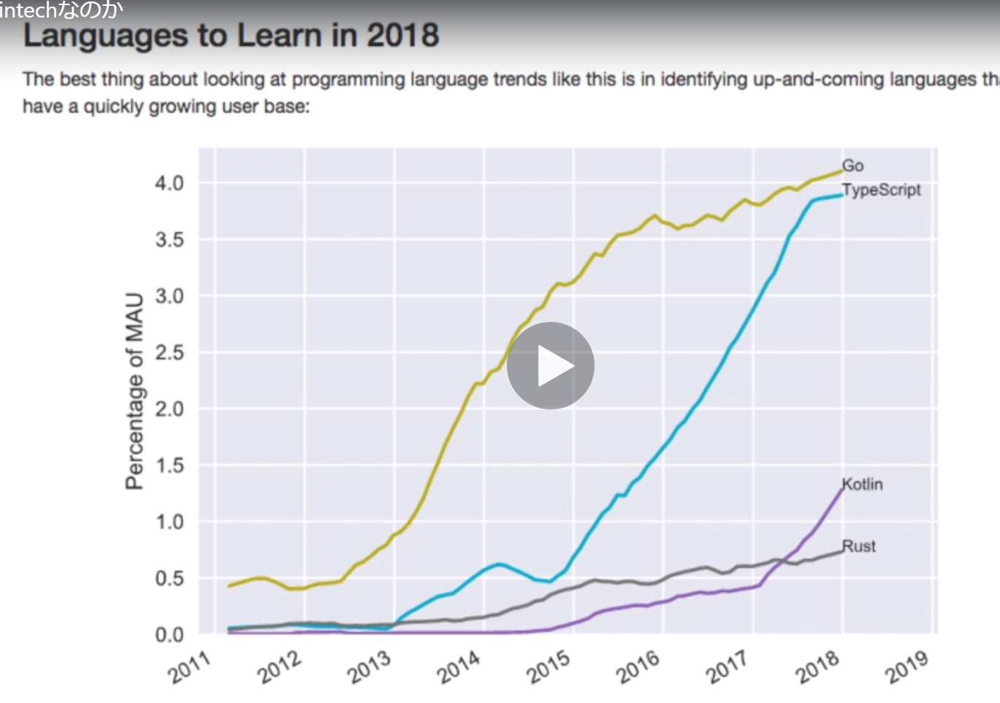

# 基本
## 全体トレンド

Fintech, AI, Robot, Rocket

## Go
### 基本情報
1. 既存言語のアイデアをもとに生み出された新しいプログラミング言語 (2009誕生)
1. 特徴
    - 早いコンパイル速度、実行速度
    - メモリ管理 (GC)
    - マルチコア活用 (goroutine)
    
### Memo
1. fmt: format library
1. 変数
   - varを利用する
   - shortの宣言は関数内しかできない
        - 例: x := 1
   - const: 定数
   - 複数の値を宣言するときは()を利用する
1. Style
   - = の位置を合わせる
1. string
    - lib: strings
    - type: string
1. nilを利用する。    
    

    
    

