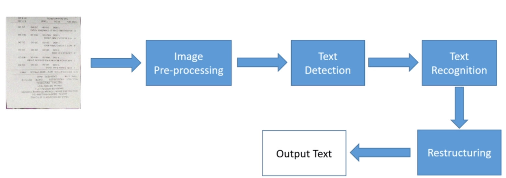
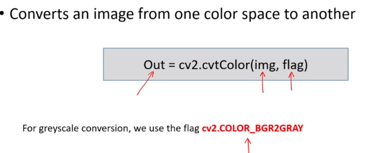
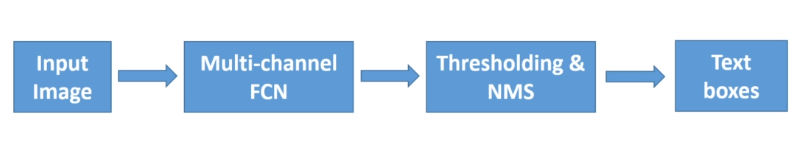
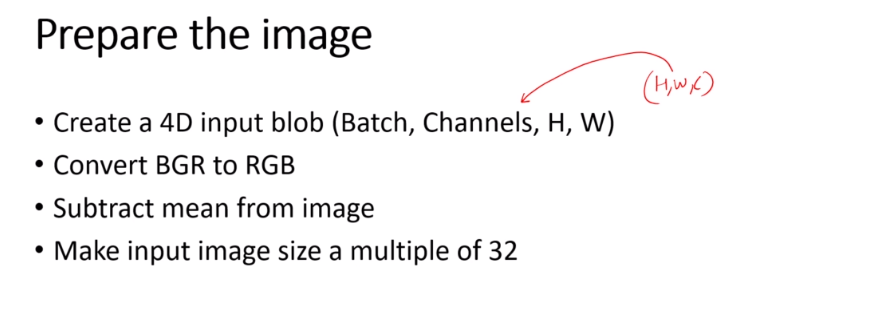
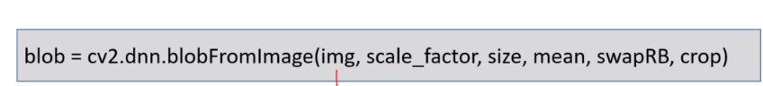
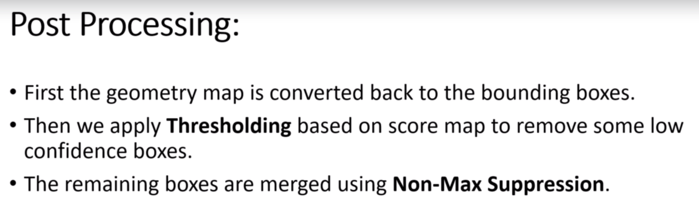

# Basic
1. pipe line
    * 
    
# Pre-processing (OpenCV)
1. Image Normalization
    * 0-255 => 0-1
    * why
        * deep learning models converge faster
        * improves the training stability of model
    * tech
        * divide by the maximum
        * min-max scaling
        * standardization
1. Image Resizing
    * resize function 
1. Greyscale Conversion
    * save both resources and time
    * 
1. Noise removal
    * random variation of brightness or color information in images
    * Noise types
        * salt and pepper noise: median filter
        * gaussian noise: gaussian blurring
        * speckle noise
        * poisson noise
    * No single noise remove technique can work for all type of noises
    * techniques in open cv
        * medianBlur
    
1. Skew correction
    * No single technique that works for all types of images
    * Step: select feature to calculate the skew angle
    * Functions
        * cv2.minAreaRect()
1. line removal

# Text Detection
1. Define: finding regions in the image where text can be present
1. Image Type
    * structured text
        * clean/ uniform background
        * regular font
    * Unstructured text
        * sparse text on a complex background
        * different color, font, text size 
    
1. Steps
    * character detection
    * word detection
    * line detection
    
1. Methods
    * conventional methods
    * deep-learning based methods
    
## EAST (Efficient and Accurate Scene text detector) algorithm
1. allows end-to-end training and optimization
1. EAST pipeline
    * 
    
1. opencv-EAST
    * 
    * 
    * 
   
## CTPN 
1. Connections Text Proposal Network

## Text Recognition
1. Model CTC (Connectionist Temporal Classification)

## Tesseract
1. Since 2006 it is developed and maintained by Google
1. LSTM based OCR engine
1. recognize 116 languages
1. Step   
   * install Tesseract
   * pip install pytesseract

    
