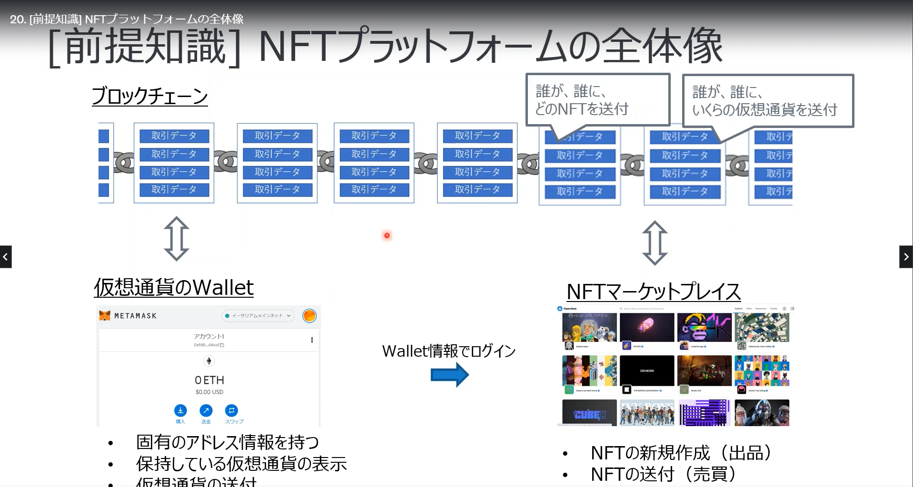
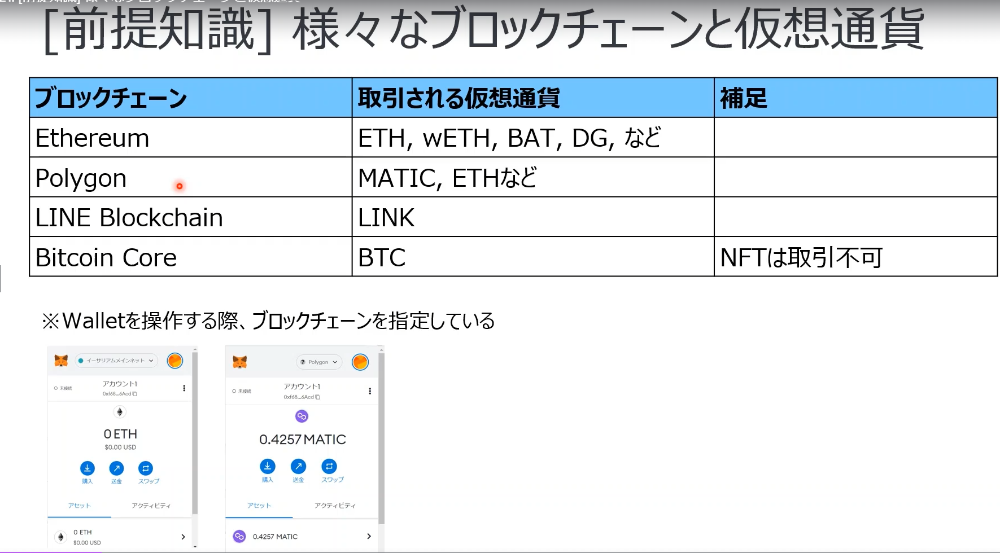
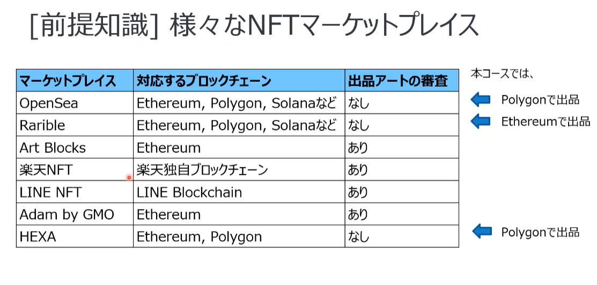
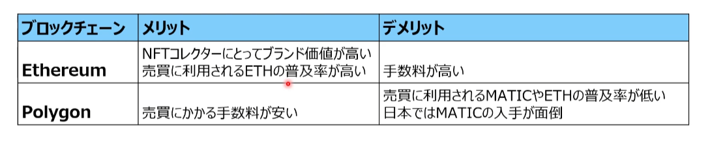
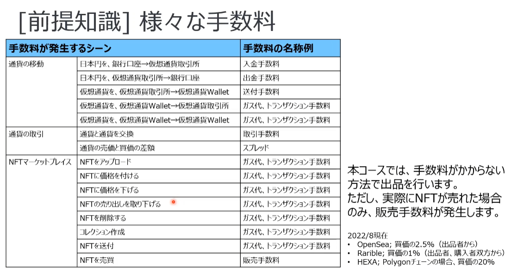
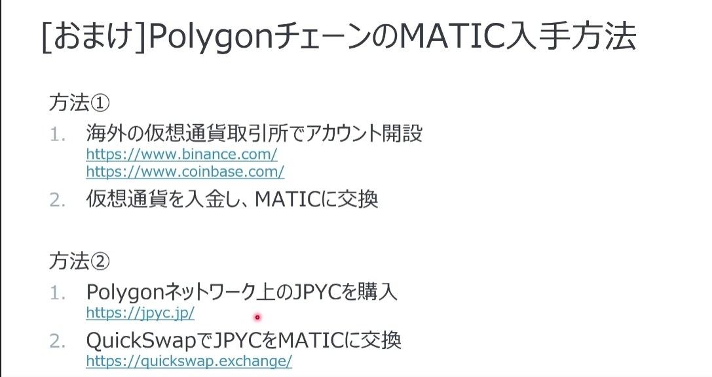

# url
https://www.udemy.com/course/generative-nft/learn/lecture/33593170#overview

# メモ
1. ジェネラティブNFT: プログラムやアプリによって自動生成されたNFTアート
2. NFT販売イメージ: OpenSea

# デザインパーツ作成

# アート作品の大量生成
https://github.com/moyattodataman/generative_art

# アート作品の出品
## NFTプラットフォームの全体像

   
   
## ブロックチェインと仮想通過

   

## NFTマーケットプレイス

## Ethereum, Polygonの比較

## 手数料

## Metamask
1. 仮想通貨のWallet
2. EthereumやPolygon上の仮想通貨を管理できる。ビットコインは管理できない。

